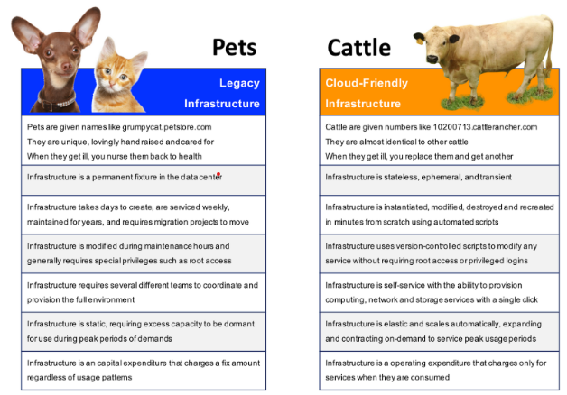
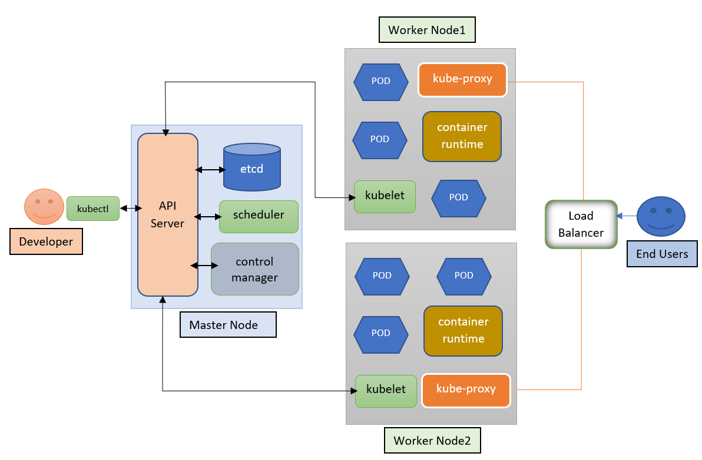
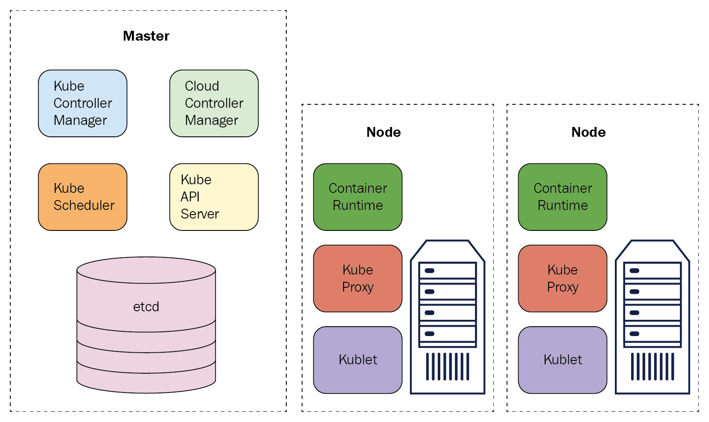
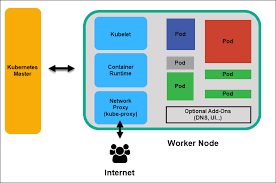
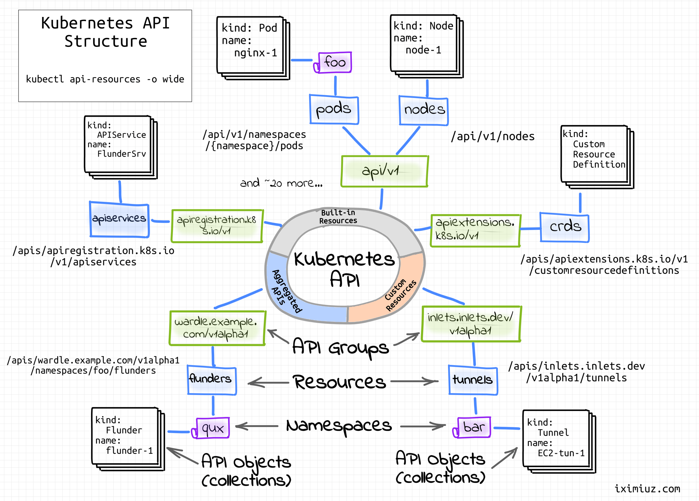
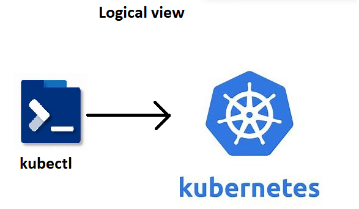
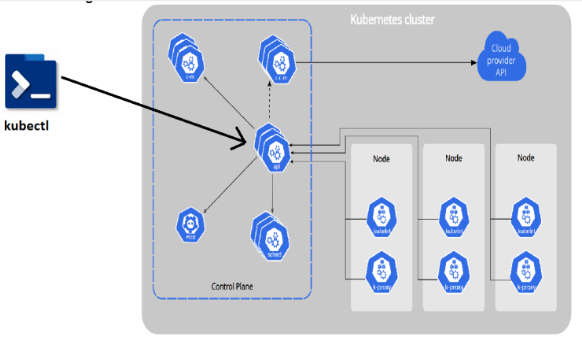
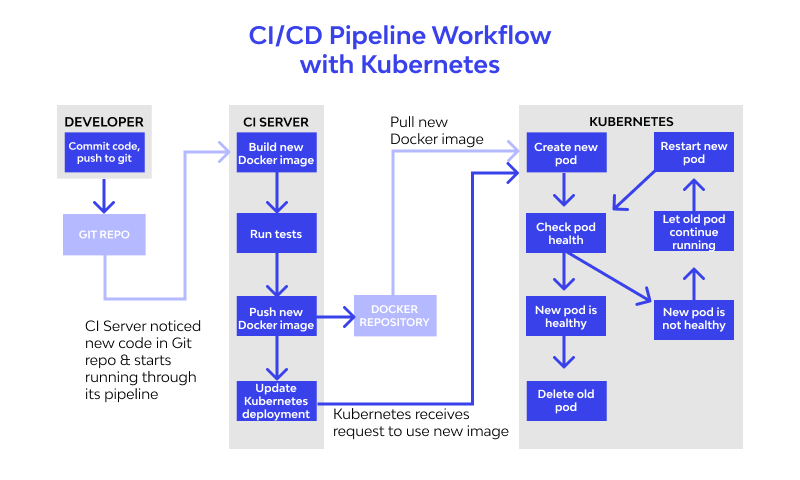

**What is Kubernetes**

## Need for K8s
# High Availability (HA):
* When we run our applications in docker container and if the container fails, we need to manually start the container
* If the node i.e. the machine fails all the containers running on the machine should be re-created on other machine
* K8s can do both of the above
# Autoscaling
* Containers don’t scale on their own.
* Scaling is of two types
   * Vertical Scaling
   * Horizontal Scaling
* K8s can do both horizontal and vertical scaling of containers
# Zero-Down time Deployments
* K8s can handle deployments with near zero-down time deployments
* K8s can handle rollout (new version) and roll back (undo new version => previous version)
# K8s is described as Production grade Container management
# History
* Google had a history of running everything on containers.
* To manage these containers, Google has developed container management tools (inhouse)
   * Borg
   * Omega
* With Docker publicizing containers, With the experience in running and managing containers, Google has started a project Kubernetes (developed in Go) and then handed it over to Cloud Native Container Foundation (CNCF)
# Competetiors
* Apache Mesos
* Hashicorp Nomad
* Docker Swarm
* But K8s is clear winner
# Terms
* Distributed System
* Node
* Cluster
* State
* Stateful Applications
* Stateless Applications
* Monolith
* Microservices
* Desired State
* Declarative vs Imperative
* Pet Vs Cattle

# K8s is not designed only for Docker
Initially k8s used docker as a main container  platform and docker used to get special treatment, from k8s 1.24 special treatment is stopped.
* k8s is designed to run any container technology, for this k8s expects container technology to follow k8s interfaces.
# **K8s Architecture** 
**Architecture image**

* Other easier representations
# Master Node

## Kubernetes Components
* Refer Here for the k8s components article
* Control plane components (Master Node Components)
  * kube-api server
  * etcd (*)
  * kube-scheduler
  * controller manager
  * cloud controller manager
# Node Architecture

# **Node Components**
* kubelet
* kube-proxy
* Container run time (*)
# **kube-api server**

* Handles all the communication of k8s cluster
* Let it be internal or external
* kube-api server exposes functionality over HTTP(s) protocol and provides REST API
# Clients
* kubectl
* any rest based client
# Logical view

# Actual view

# Kubernetes Components
* Refer Here for the k8s components article
* Control plane components (Master Node Components)
  * kube-api server
  * etcd (*)
  * kube-scheduler
  * controller manager
  * cloud controller manager
# Node Components
* kubelet
* kube-proxy
* Container run time (*)
# kube-api server
* Handles all the communication of k8s cluster
* Let it be internal or external
* kube-api server exposes functionality over HTTP(s) protocol and provides REST API
## etcd: 
* Refer Here for etcd
* This is memory of k8s cluster
## scheduler
* Scheduler is responsible for creating k8s objects and scheduling them on right node
## Controller
* Controller Manger is responsible for maintaining desired state
* This reconcilation loop that checks for desired state and if it mis matches doing the necessary steps is done by controller
## Kubelet
* This is an agent of the control plane
## Container Runtime
* Container technology to be used in k8s cluster
* in our case it is docker.
## Kube-Proxy
* This component is responsible for networking for containers on the node
## kubectl
* This is command line that can be installed on the machine from which you communicate to k8s cluster.
* This tool is created to make communication with api-server simplified.
* Kubectl has a config file (KUBECONFIG) which contains
   * api-server information
   * keys to communicate with api server
* Kubectl allows to communication with cluster to create resources 
   * imperatively: Type commands
   * declartively: Write manifests (YAML files)
* Reads manifests and connects to api server. Converts the manifest into REST API calls over JSON
## What is k8s manifest
* This is a yaml file which describes the desired state of what you want in/using k8s cluster
## CI/CD Workflow

